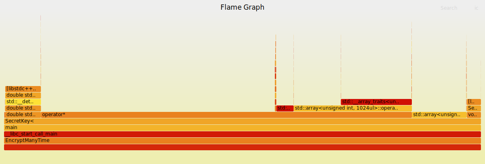

Learning With Errors (or by making them)
========================================

The following repository contains a simple (and most likely not secure) implementation of a homomorphic encryption scheme based on the Learning With Errors (LWE) problem.

**Note**: This README relies heavily on $\LaTeX$-style math notation. It seems to render fine on GitHub and in the VS Code markdown preview, but I have not tested it elsewhere.

Usage
-----

**Building**:

The code uses cmake. For testing, we use Catch2, but is besides that self contained.

To compile the code, you can for instance run:

```bash
cd build
cmake ..
cmake --build .
```
or
```bash
cd build
cmake -DCMAKE_BUILD_TYPE=Release ..
cmake --build .
```
for an optimized build.

**Interface**:

There is no io interface for the code. The code is meant to be used as a library, and the `main` function is just for testing and profiling purposes.

The main star of this repository is the `SecretKey` template class. It takes two security parameters, $N$ the size of the polynomial, and $k$ the number of samples. The third parameter, the modulus $q$, is fixed to $2^{32}$ as seems common in TFHE. The user is responsible for their own security parameters, but we will do our best to provide some guidance in the section [Security Parameters](#security-parameters) below.

To start encrypting and decrypting, all that is needed is to initialize a `SecretKey` object as follows:

```cpp
SecretKey<k, N> sk;
```

The message space is the set $\mathbb{Z}_{2^8}^N$. In other words, we put one byte on each coefficient of the polynomial. Messages should be encoded in the four *least significant bits* when given to the encryption function.

```cpp
std::array<int, N> m = {1, 2, 3, 4, 5, 6, 7, 8, 9, 10, 11, 12, 13, 14, 15, 0};
CipherText c = sk.encrypt(m);
```

`CipherText` is an object corresponding to an GLWE ciphertext in the flavour of TFHE. Two ciphertexts can be added, but no other operations has been implemented so far.

```cpp
CipherText c_1 = sk.encrypt(m_1);
CipherText c_2 = sk.encrypt(m_2);
CipherText c_3 = c_1 + c_2;
```
To decrypt, we use the `decrypt` method of the `SecretKey` object.

```cpp
std::array<int, N> m_dec = sk.decrypt(c);
```


Implementation
--------------

The implementation consists of three object templates:

**Polynomial**:

A class representing a polynomial with integer coefficients. It supports some basic operations like addition, subtraction, multiplication and equality. It uses a naive multiplciation algorithm with an O(n^2) complexity. It would be preferable to use (hardware accellerated :D ) FFT multiplication, but I could not make (even a regular one) work on the time I had.

**SecretKey**:

A class which sets up a secret key, and then may use it for encryption and decryption. The cryptosystem is supposed to be inspired by TFHE. The class handle the full key generation, as well as encryption and decryption.

The secret key is a `Polynomial` of degree $N-1$ with coefficients in $\{0,1\}$. 

For key and ciphertext generation, we use `std::random_device` for random number generation. This is not a cryptographically secure way to generate random numbers, since it leaves the responsibility to the underlying system. However, it is certainly good enough for this toy-implementaion.

**CipherText**:

Ciphertexts are objects on the form $(A, b)$, where $A$ is the public key, and $b$ the encrypted message. Here, $A$ is a list of $k$ `Polynomial` objects, each of degree $N-1$ with coefficients in $\mathbb{Z}_{2^{32}}$, and $b$ is one such polynomial.
The ciphertexts are encrypted using the secret key, and can be added together.

Performance considerations
--------------------------

**Computation speed**:

One clear performance issue with the current implementation is the lack of FFT multiplication. 

Because I did not manage to get FFT to work, it gave me a bit less abilities to optimize the rest of the code. Since the c++-compiler is really clever, I often find it difficult to know how changes will affect the performance. To me, the only real way to progress is to profile the code.

I did a small attempt at profiling, and produced the following flamegraph:



The flamegraph shows that the majority of the time is spent in the multiplication operator. The reasonable interpretation of this is that it is indeed the absense of FFT multiplication that is the bottleneck. One could probably dig deeper into this, and learn more about the performance even in the absence of FFT multiplication, but that would require more time and effort.

One example of why I find it so important to measure is when I tried to make an optimization which I thought would be an obvious win. Looking at the `encrypt` method in the `SecretKey` class, it currently copies the array `plain` in the function definition. Then it copies it again to create the polynomial which is added to `cipher.b`.

I thought that it should be possible to get rid of these two to copies, and instead add the shifted plain elements directly to the polynomial coefficients. However, in my attempt, this turned out to be slower than the current implementation.


This might of course be because I made some error in my implementation. But it might also be that the compiler is able to optimize the code in a way that I do not fully understand. Maybe the explanation has something to do with memory locality, where the program find it easier to place the copy of `plain` close to the "old" `plain` in order to do the shifting and adding of error, and then move all of it closer to the polynomial in order to do the addition. But this is very much just speculation.

The branch `direct_access_to_polynomial` contains this "optimization". 

**Homomorphic performance**:

Let us consider how many additions we can do before the noise becomes too large. For my scheme, I have chosen (and hard coded) a message size of $2^8$ per coefficient. This was fairly arbitrarily chosen; any choice would be a trade-off between the message size and the number of operations we can do, and I do not yet have a good understanding on the number of operations one would want to do.

It is my understanding that addition is the "nice" operation, increasing the error the least. Thus discussing only addition is a bit misleading. However, since that is all I have implemented, this is what I will do.

Let us instead think about the error from a theoretical point of view. Our initial errors has $\sigma = 2^7$ and $\Delta = 2^{24}$. The variance is $\sigma^2 = 2^{14}$. Let $m$ be the number of operations. Since variances of independent random variables add, we get
$$2^{23} \approx \sqrt{m2^{14}} \Rightarrow 2^{46} \approx m 2^{14} \Rightarrow m \approx 2^{32}.$$
This is a crazy amount of additions, and probably suggests that I could have chosen a smaller $\Delta$. However, this is again only the sums, and it is quite possible that multiplication and other operations would increase the error much more.

Testing this in practice is not feasible. In one of my tests, I tried adding $100000$ ciphertexts, and this worked fine (as expected).


Security Considerations
-----------------------

Let us start by noting that this discussion (apart from the last comment on randomness) talks about the LWE problem in general. Things like side-channel attacks, or other attacks made possible by bad implementations (such as, probably, my own) are not considered.

**Connection between LWE and RLWE/GLWE**:

(The following renders terribly on GitHub, but perfectly fine in the VS Code preview. I can not really change it, so the reader might want to look at the source code and put it into their favourite $\LaTeX$-renderer.)

If we have polynomials $$B = \sum_i^Nb_ix^i,\quad A = \sum_i^Na_ix^i,\quad S = \sum_i^Ns_ix^i,\quad M = \sum_i^Nm_ix^i,\quad E = \sum_i^Ne_ix^i$$
then the equation
$$B = AS + \Delta M + E$$
can be written as (using multiplication modulo $X^N+1$) the following system of equations:
$$
\begin{pmatrix}
b_0 \\
b_1 \\
\vdots \\
b_{N-1}
\end{pmatrix}
=
\begin{pmatrix}
a_0 & a_{N-1} & a_{N-2} & \dots & a_{1} \\
a_1 & a_0 & a_{N-1} & \dots & a_{2} \\
\vdots &  &  & \ddots & \vdots \\
a_{N-1} & a_{N-2} & a_{N-3} & \dots & a_{0} \\
\end{pmatrix}
\begin{pmatrix}
s_0 \\
s_1 \\
\vdots \\
s_{N-1}
\end{pmatrix}
+
\Delta
\begin{pmatrix}
m_0 \\
m_1 \\
\vdots \\
m_{N-1}
\end{pmatrix}
+
\begin{pmatrix}
e_0 \\
e_1 \\
\vdots \\
e_{N-1}
\end{pmatrix}
$$
Thus, if LWE is not hard, then neither is RLWE/GLWE (Note that the reverse is not necessarily true, since we are considering a special set of matrices. However, at least until recently, there does not seem to be any attack using this special structure, see e.g. page 132 of [Parameter selection
in lattice-based cryptography - Rachel Player](https://pure.royalholloway.ac.uk/ws/portalfiles/portal/29983580/2018playerrphd.pdf)). We will therefore focus our discussion on LWE.

**The Lattice Estimator**:

A nice resource for estimating the parameters needed for LWE is the [Lattice Estimator](https://github.com/malb/lattice-estimator). It seems to be well trusted in the community, seeing that the [original TFHE repository](https://github.com/tfhe/tfhe) links to its predecessor.
Looking at that, we find that the standard parameters for TFHE1024 is $N = 1024$, $q = 2^{32}$, $k = 1$ and $\sigma = 2^7$ (the standard deviation of the error distribution). Calculating the securtity estimate for these parameters I get $122$ bits, which is very close to the commonly used bar of 128.

For this implementation, I have hard coded $\sigma = 2^7$ and $q = 2^{32}$. We note that $N = 1024$ and $k = 1$ will be sufficient in this situation (depending on the needs of the user). The user may use other combinations of $N$ and $k$.


**Where does the bounds come from**:

I have not dwelled into much depth at all on the many known attacks on LWE, so this section will just contain some small thoughts from my quest to understand what is going on.

We note that almost all attacks on LWE are based on lattice reduction (see e.g. Section 2.3 of [this article](https://eprint.iacr.org/2024/1229.pdf)). These techniques are generally exponential in the size $x$ of the lattice, but with an exponent less than 1 times $x$. For instance there is an estimation in [Parameter selection in lattice-based cryptography - Rachel Player](https://pure.royalholloway.ac.uk/ws/portalfiles/portal/29983580/2018playerrphd.pdf) estimating the runtime of the lattice reduction algorithm BKZ to be $O(2^{0.292x})$ where $x$ is the size of the lattice. This gives some insight to why we need an $N$ much larger than our security parameter.


It is also interesting to note the close connection between the hardness of LWE and the hardness of the closest vector problem (CVP) in lattices. Indeed, for a homomorphic scheme, we can always obtain a sample where $M = 0$ (e.g. by multiplication with $0$). In this situation, finding $S$ is exactly an instance of a closest vector problem (CVP) in the lattice spanned by the columns of the matrix corresponding to $A$ (given that the error is small). However, solving CVP also relies on lattice reduction, and therefore seems to have hardness similar to LWE.

It is interesting that we need such a large error ($\sigma = 2^7$). From a performance perspective of our scheme, we would of course want the error to be as small as possible. From a purely brute-forcing perspective, we also do not need an error that large; since $N$ is large and we get some error for each coefficient, an error of just a single bit would be enough if brute-forcing alone was the problem. Of course, it is not so.

One attack which seems to rely on small noise is the [Aurora-Ge attack](https://users.cs.duke.edu/~rongge/LPSN.pdf). As described in the article, it is only applicable on $\mathbb{Z}_q$ for prime $q$, but let us ignore that (there are probably subsequent improvements, or similar attacks which work on $\mathbb{Z}_{2^m}$).
Let $x$ be the size of the problem, and $\epsilon < 1/2$ be a parameter. Then the attack is $O(2^{n^{2\epsilon}})$ under the condition that $\sigma < x^{\epsilon}$ and $q$ is large enough. Note that $\epsilon = 0.35$ gives us a security of 128 bits. Thus, the error needs to be at least $1024^{0.35} \approx 11$. This is still less than $128$, but is a first intuition on why we need a large error.


**Randomness**:

It should be noted that `std::random_device` is not guaranteed to provide good randomness. For instance, the standard implementation on linux is to read from `/dev/urandom`, which is generally a good source of randomness. However, `/dev/urandom` does not know whether it has enough avaialble entropy, so the quality may deteriorate if a lot of randomness is required. The likelyhood of this being a problem depends on the system.

It also seems like the standard way to use `std::random_device` is to seed some other pseudo-random number generator (such as the merseinne twister in `std::mt19937`) with it. I am unsure if this is done only for performance reasons, or if there is some underlying problem with how `std::random_device` works (e.g. the randomness not being whitened enough). Until I better understand if there are security issues with `std::random_device`, I believe using it directly should be more secure (at least on a system with good randomness availability).

Future Work
-----------

If I were to continue working on this repository in the future, the first thing I would do is another attempt at making FFT work. The problems I ran into appeared when I ran the algorithm on polynomials with large coefficients, so properly thinking through how this affects the algorithm would be a good first step.

With the FFT in place, it would be interesting to more properly profile the code, perhaps using more advanced tools. Then it would be possible to find the bottle necks and try to reduce them one by one.

One could also consider implementing more operations, such as multiplication, key-switching and bootstrapping. However, this would require a lot of work, and since there are already libraries which do this, I would probably rather try to understand the alredy existing libraries codebases better.


